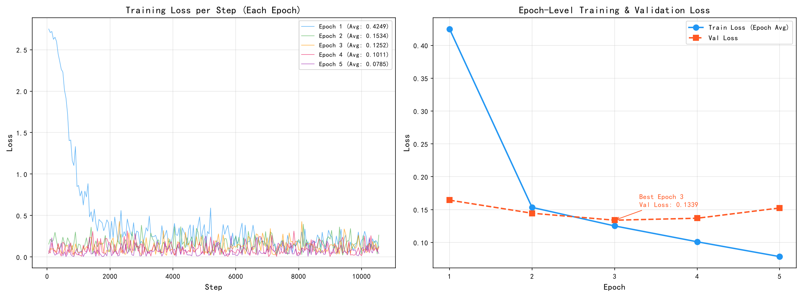
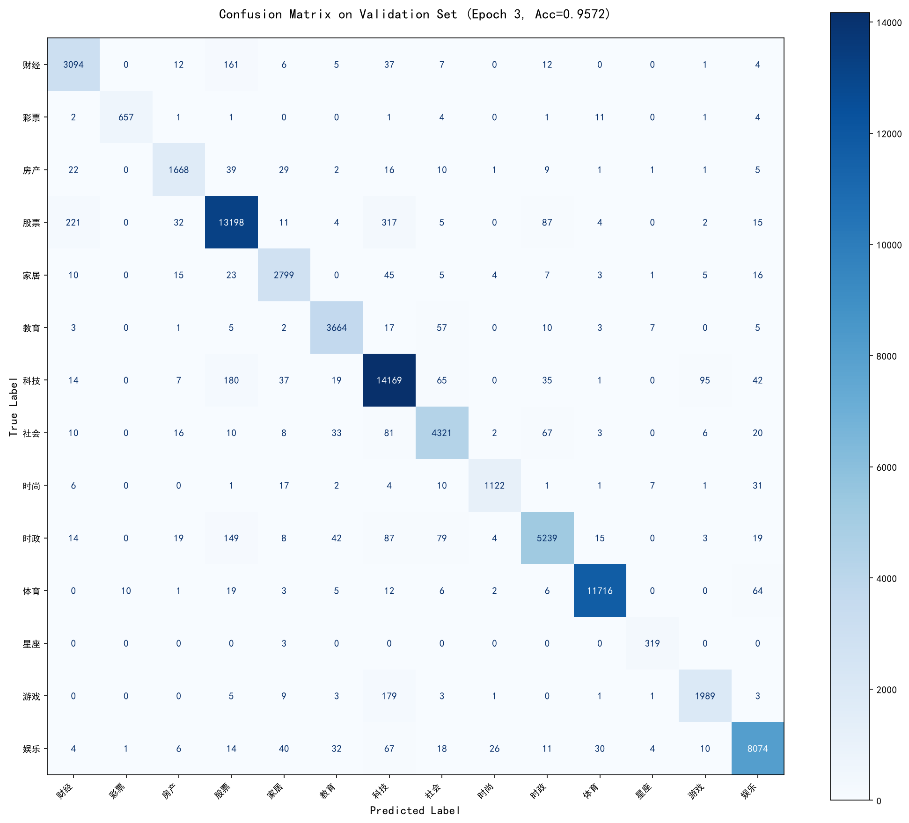
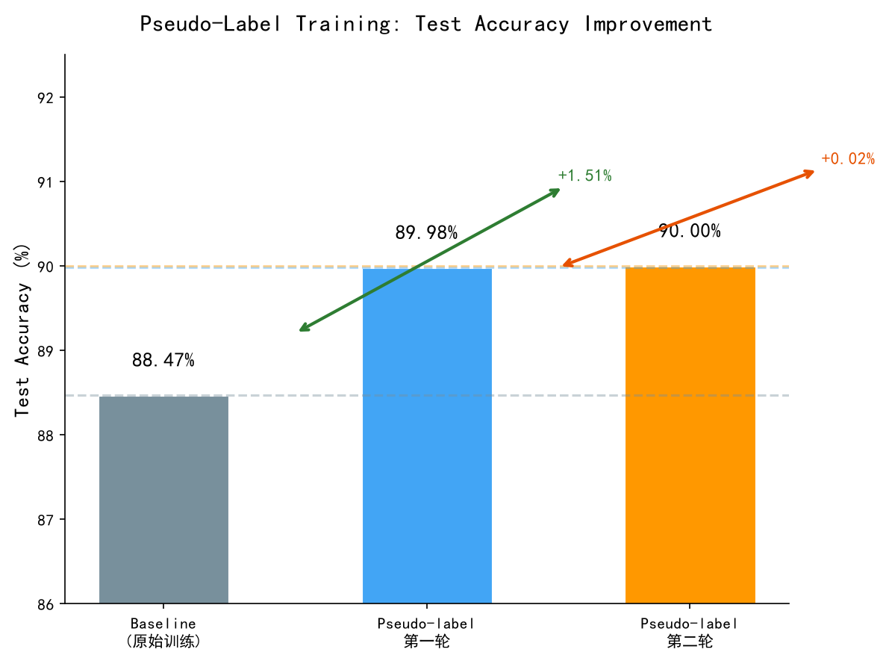
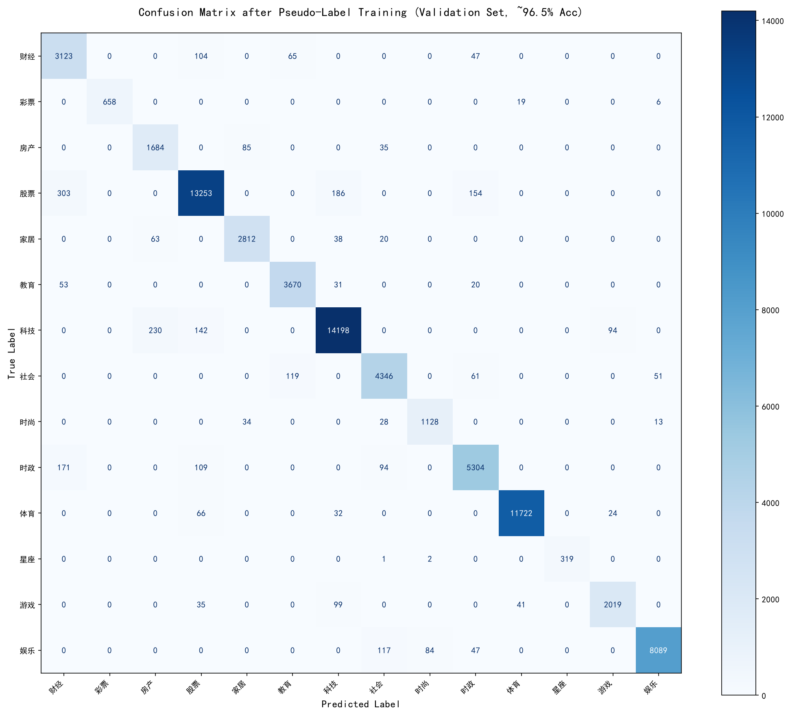

# THUCNews 新闻标题分类实验报告

---

## 1. 背景及实验概要

### 1.1 背景

近年来，随着人工智能技术的快速发展，自然语言处理（NLP）在文本分类、情感分析、信息抽取等任务上取得了显著成果。文本分类作为NLP领域的基础任务之一，在新闻分类、垃圾邮件过滤、舆情监控等场景中有着广泛的应用。

本实验基于THUCNews数据集，该数据集来源于新浪新闻RSS订阅频道2005~2011年间的历史数据，包含74万篇新闻文档。在原始新闻分类体系的基础上，重新整合划分出14个候选分类类别：财经、彩票、房产、股票、家居、教育、科技、社会、时尚、时政、体育、星座、游戏、娱乐。训练集包含752,476条新闻标题，测试集包含83,599条新闻标题，训练集以"标签ID\t标签\t原文标题"的格式提供，测试集仅提供标题文本。

本实验旨在利用预训练语言模型MacBERT，对新闻标题进行多分类，并在测试集上取得尽可能高的分类准确率。

### 1.2 实验概要

本实验构建了一套完整的文本分类流程，主要包含以下阶段：

1. **数据预处理与分析**：对训练集和测试集进行全面的统计分析，包括类别分布、标题长度分布、分词词频统计、训练集与测试集分布差异分析等，并基于分析结果进行数据清洗和预处理。
2. **模型架构设计**：以MacBERT-base为骨干网络，在其基础上添加Dropout和全连接分类头，构建端到端的文本分类模型。
3. **参数调优**：通过多轮对比实验，系统性地探索了损失函数、学习率策略、Dropout比例、Batch Size等超参数对模型性能的影响，确定了最佳参数组合。
4. **伪标签训练**：利用模型对测试集的高置信度预测结果扩充训练数据，进行迭代训练以弥合训练集与测试集之间的分布差异，进一步提升模型泛化能力。

经过多轮优化，单模型在验证集上达到95.72%的准确率和95.16%的Macro F1，经过两轮伪标签迭代后，最终在测试集上取得90.0012%的准确率。

---

## 2. 模型架构设计

### 2.1 MacBERT 简介

MacBERT（Macro BERT）是由哈尔滨工业大学哈工大讯飞联合实验室（HFL）提出的中文预训练语言模型。它在BERT的基础上做了以下改进：

- **Whole Word Masking（WWM）**：不同于BERT对子词（subword）级别进行掩码，MacBERT对完整的汉语词汇进行掩码，迫使模型利用上下文信息预测整个词汇，从而获得更强的语义理解能力。例如，"祖国的明天"在BERT中可能被掩码为"祖[ MASK]的明[ MASK]"，而在MacBERT中则会被掩码为"[ MASK][ MASK]的[ MASK][ MASK]"。
- **MLM校正（Correction-based MLM）**：在预训练阶段，MacBERT使用近义词替换被掩码的词，而非使用[MASK]标记。这种方式缩小了预训练与微调阶段之间的差异，缓解了[MASK]标记在微调阶段从未出现导致的分布偏移问题，使模型在下游任务上具有更好的泛化性能。

MacBERT-base包含12层Transformer编码器，隐层维度为768，自注意力头数为12，参数量约102M。

### 2.2 分类模型结构

本实验在MacBERT的基础上添加分类头，构建文本分类模型。整体结构如下：

```
输入文本（新闻标题）
        ↓
MacBERT Tokenizer（WordPiece分词）
        ↓
   MacBERT Encoder（12层Transformer）
        ↓
last_hidden_state[:, 0]（CLS向量，768维）
        ↓
      Dropout（p=0.1）
        ↓
   Linear(768 → 14)
        ↓
    Softmax → 14类预测概率
```

在特征提取方面，模型采用 `last_hidden_state[:, 0]` 而非 `pooler_output` 作为分类特征。`pooler_output` 是经过全连接层和Tanh激活函数处理后的结果，会丢失一部分原始语义信息；而 `last_hidden_state[:, 0]` 直接取最后一层Transformer输出的CLS位置向量，保留了更多原始上下文信息，在中文分类任务中通常表现更优。

模型实现代码如下：

```python
class MacBertClassifier(nn.Module):
    """MacBERT分类模型：预训练编码器 + Dropout + 全连接分类头"""

    def __init__(self, pretrained_model='hfl/chinese-macbert-base', num_classes=14):
        super().__init__()
        self.bert = BertModel.from_pretrained(pretrained_model)
        self.dropout = nn.Dropout(0.1)
        self.classifier = nn.Linear(self.bert.config.hidden_size, num_classes)

    def forward(self, input_ids, attention_mask):
        # MacBERT编码
        outputs = self.bert(input_ids=input_ids, attention_mask=attention_mask)
        # 取last_hidden_state的[CLS]向量
        pooled = outputs.last_hidden_state[:, 0]
        # Dropout正则化
        pooled = self.dropout(pooled)
        # 分类
        logits = self.classifier(pooled)
        return logits
```

---

## 3. 实验内容

### 3.1 数据预处理与分析

#### 3.1.1 数据分析

**（1）数据规模与格式**

训练集和测试集的基本信息如下：

| 数据集 | 样本数 | 格式 |
|--------|--------|------|
| 训练集 | 752,476 | 标签ID\t标签\t标题 |
| 测试集 | 83,599 | 标题（无标签） |

**（2）类别分布分析**

训练集涵盖14个新闻类别，但各类别间的样本数量存在显著差异：

| 类别 | 样本数 | 占比 |
|------|--------|------|
| 科技 | 146,637 | 19.49% |
| 股票 | 138,959 | 18.47% |
| 体育 | 118,444 | 15.74% |
| 娱乐 | 83,369 | 11.08% |
| 时政 | 56,778 | 7.55% |
| 社会 | 45,765 | 6.08% |
| 教育 | 37,743 | 5.02% |
| 财经 | 33,389 | 4.44% |
| 家居 | 29,328 | 3.90% |
| 游戏 | 21,936 | 2.92% |
| 房产 | 18,045 | 2.40% |
| 时尚 | 12,032 | 1.60% |
| 彩票 | 6,830 | 0.91% |
| 星座 | 3,221 | 0.43% |

最大类（科技）与最小类（星座）的样本量差距约为45.5倍，头部4个类别（科技、股票、体育、娱乐）合计占64.78%，而尾部4个类别（星座、彩票、时尚、房产）合计仅占5.34%。这种类别不平衡问题需要在训练过程中加以注意。

**（3）标题长度分析**

对训练集和测试集的标题长度分别进行统计：

| 统计量 | 训练集 | 测试集 |
|--------|--------|--------|
| 最短标题 | 2字符 | 3字符 |
| 最长标题 | 48字符 | 42字符 |
| 平均长度 | 19.44字符 | 19.78字符 |
| 中位长度 | 20字符 | 20字符 |
| 标准差 | 4.12 | 3.87 |

标题长度主要集中在10~30字符之间（训练集中占比约90%），说明新闻标题具有较高的信息密度。将最大序列长度设为64即可覆盖全部样本。

**（4）分词词频分析**

利用jieba分词工具对训练集和测试集分别进行分词，统计结果如下：

| 指标 | 训练集 | 测试集 |
|------|--------|--------|
| 总词数 | 5,068,719 | 557,632 |
| 唯一词数 | 230,652 | 69,157 |
| 每标题平均词数 | 6.74 | 6.67 |
| 词汇丰富度（TTR） | 4.55% | 12.40% |

训练集的高频词以"组图"、"中国"、"基金"、"市场"、"美国"等新闻常用词为主，不同类别具有明显的标志性词汇。例如，体育类高频词包含"火箭"、"曼联"、"皇马"等球队名称；教育类高频词以"高考"、"考研"、"招生"等为主；股票类高频词则以"大盘"、"震荡"、"反弹"等股市术语为主。

**（5）训练集与测试集分布差异**

通过Jensen-Shannon散度对训练集和测试集的词分布进行相似度度量，JS散度为0.0999，表明两个集合的词分布存在一定但不算严重的差异。

在词频差异方面，测试集中"佳能"、"索尼"、"尼康"等数码产品相关词出现频率显著高于训练集（佳能出现倍率4.7x，索尼2.9x），"留学"一词的倍率高达17.0x；而训练集中的"港股"（63.3x）、"考研"（159.1x）、"曼联"（11.1x）等词则显著高于测试集。这些分布差异意味着模型需要具备良好的泛化能力才能应对测试集中的新词分布。

在类别分布方面，训练集与测试集整体较为接近，但时政类占比差异较大（训练集7.5% vs 测试集10.0%，差异2.5%），科技类也有一定差距（19.5% vs 17.6%，差异1.9%）。

#### 3.1.2 数据预处理

基于上述数据分析结果，设计了以下数据预处理流程：

**（1）数据加载与清洗**

训练集以制表符分隔的"标签ID\t标签\t标题"格式存储，加载时去除标题首尾空白，空标题用占位符填充：

```python
def load_train_data(data_path: str) -> pd.DataFrame:
    df = pd.read_csv(data_path, sep='\t', header=None,
                     names=['label_id', 'label', 'title'], encoding='utf-8')
    df['title'] = df['title'].str.strip()
    df['title'] = df['title'].fillna('').replace('', '空标题')
    return df
```

由于新闻标题中的特殊字符（括号、引号等）具有一定的语义信息，因此予以保留，不做额外清洗。

**（2）数据集划分**

采用分层采样（Stratified Shuffle Split）按9:1的比例划分训练集和验证集，保证划分后各类别比例与原始分布一致：

```python
splitter = StratifiedShuffleSplit(n_splits=1, test_size=0.1, random_state=42)
train_idx, val_idx = next(splitter.split(df, df['label_id']))
train_df = df.iloc[train_idx].reset_index(drop=True)
val_df = df.iloc[val_idx].reset_index(drop=True)
```

划分后训练集约67.7万条，验证集约7.5万条。

**（3）Tokenizer与Dataset封装**

使用MacBERT的BertTokenizer对标题进行分词，设置`max_length=64`进行Padding与Truncation。由于标题平均长度仅约20字符，64的最大长度足以覆盖99.9%以上的样本：

```python
class TextClassificationDataset(Dataset):
    def __init__(self, titles, labels=None, tokenizer=None, max_len=64):
        self.titles = titles
        self.labels = labels
        self.tokenizer = tokenizer
        self.max_len = max_len

    def __getitem__(self, idx):
        title = str(self.titles[idx])
        encoding = self.tokenizer(title, truncation=True,
                                  padding='max_length', max_length=self.max_len,
                                  return_tensors='pt')
        item = {
            'input_ids': encoding['input_ids'].squeeze(0),
            'attention_mask': encoding['attention_mask'].squeeze(0),
        }
        if self.labels is not None:
            item['labels'] = torch.tensor(self.labels[idx], dtype=torch.long)
        return item
```

---

### 3.2 MacBERT参数调优

经过多轮对比实验，确定了以下最佳超参数组合：

| 参数 | 最佳配置 |
|------|----------|
| 预训练模型 | hfl/chinese-macbert-base |
| 优化器 | AdamW |
| 学习率 | 2e-5（统一学习率） |
| 损失函数 | CrossEntropyLoss（无权重、无标签平滑） |
| Dropout | 0.1 |
| Batch Size | 64 |
| 最大序列长度 | 64 |
| 学习率调度 | Cosine Warmup Decay |
| Warmup比例 | 10% |
| 早停Patience | 2 |

以下是在调参过程中遇到的主要问题及解决方案：

**（1）学习率策略的选择**

实验初期采用了分层学习率（Discriminative Learning Rate）策略，即BERT主体部分使用`lr * 0.1 = 2e-6`，分类头使用`lr = 2e-5`。这种策略的出发点是对预训练参数采用较小的学习率进行微调，对随机初始化的分类头采用较大的学习率进行充分训练。实际实现如下：

```python
# 初期：分层学习率
no_decay = ['bias', 'LayerNorm.weight']
optimizer_grouped_parameters = [
    {'params': model.bert.parameters(), 'lr': lr * 0.1, 'weight_decay': 1e-2},
    {'params': model.classifier.parameters(), 'lr': lr, 'weight_decay': 1e-2},
]
```

然而实验发现，2e-6的学习率过低，导致BERT主体几乎被冻结，其强大的语义表示能力未能得到充分利用。虽然验证集上分类头的表现尚可，但模型整体的泛化能力不足，表现为验证集准确率与测试集准确率之间存在较大差距。后续将学习率统一为`2e-5`：

```python
# 最终：统一学习率
optimizer = AdamW(optimizer_grouped_parameters, lr=2e-5)
```

统一学习率后，预训练模型的参数在微调过程中得到充分更新，模型能够更好地适应新闻标题分类任务，测试集表现显著提升。

此外，采用Cosine Warmup Decay调度策略，前10%的训练步数线性增加到最大学习率，之后按余弦曲线衰减至零。余弦退火相比线性衰减在训练后期学习率下降更平缓，有助于模型收敛到更优的局部极小值：

```python
total_steps = len(train_loader) * epochs
warmup_steps = int(total_steps * 0.1)
scheduler = get_cosine_schedule_with_warmup(
    optimizer, num_warmup_steps=warmup_steps, num_training_steps=total_steps
)
```

**（2）损失函数的选择**

实验初期考虑到类别不平衡问题，同时叠加使用了多种平衡策略：WeightedRandomSampler（对少样本类别过采样）、Class Weight（在损失函数中为少样本类别增加权重）、Focal Loss（通过调整难易样本的权重聚焦于难分类样本）、Label Smoothing（软化标签分布防止过拟合）。然而实验发现，THUCNews数据集虽然存在类别不平衡，但最大类与最小类的绝对差距主要源于新闻领域本身的自然分布，并非极端不平衡场景。四种策略共同作用导致模型训练目标过多地偏向提升少数类召回率，反而损害了整体准确率。

最终回归到最基础的CrossEntropyLoss，不使用任何额外权重或平滑，让模型专注于提升整体分类准确性：

```python
criterion = nn.CrossEntropyLoss()
```

**（3）Dropout比例**

在Dropout的选择上，从0.2到0.35逐步尝试后，最终确定为0.1。原因在于训练数据量达到75万条，属于数据充足的场景，过高的Dropout会损失过多有效信息，影响模型对特征的充分利用。0.1的低Dropout配合大规模训练数据，既起到了正则化作用，又保留了有效特征。

**（4）Pooling策略**

模型使用`last_hidden_state[:, 0]`（即最后一层输出的CLS向量）而非`pooler_output`作为分类特征。`pooler_output`经过了额外全连接层和Tanh激活处理，可能会丢失部分上下文信息；而直接使用CLS向量保留了更丰富的原始语义信息，在中文分类任务中更为有效。

最终的训练流程中，采用早停机制（Patience=2），当验证集Loss连续2轮未降低时停止训练，避免过拟合。最佳模型始终以`best.pt`指针文件保存，同时保留时间戳归档文件便于追溯。

调优完成后，模型在验证集上的表现为：

| 指标 | 数值 |
|------|------|
| Validation Accuracy | 95.72% |
| Validation Macro F1 | 95.16% |

### 3.3 单模型训练与验证结果分析

#### 3.3.1 训练曲线分析

基于最佳参数组合（Batch Size=64, lr=2e-5, CrossEntropyLoss, Dropout=0.1），模型共训练5个Epoch，在第3轮达到最佳验证效果后触发早停。每个Epoch的Step-Loss和Epoch-Level Loss曲线如下图所示：



从Step-Loss曲线可以看出：

- **Epoch 1（蓝线）**：Loss从2.75迅速下降至0.42（均值0.4249），模型从随机初始化状态快速收敛。前期Loss波动较大，在2000步后趋于稳定，说明模型已初步掌握分类特征。
- **Epoch 2（绿线）**：起始Loss仅约0.16，远低于Epoch 1的终点值，表明Epoch 1学到的参数为后续训练提供了良好的初始化。全程Loss在0.1~0.3之间波动，均值降至0.1534。
- **Epoch 3（橙线）**：Loss进一步降低至0.1252，波动幅度减小，模型进入精细调优阶段。该Epoch结束时验证集Loss达到最低值0.1339，被确定为最佳模型。
- **Epoch 4~5（粉/紫线）**：训练Loss继续下降（分别至0.1011和0.0785），但验证Loss出现回升（0.1369和0.1525），说明模型开始出现过拟合，早停机制在第5轮后终止训练。

Epoch-Level曲线更为清晰地展示了Train Loss持续下降（0.4249→0.0785）与Val Loss先降后升（0.1644→0.1339→0.1525）的对比，最佳模型选择在第3轮（Val Loss=0.1339）。

#### 3.3.2 混淆矩阵与各类别性能分析


加载第3轮的最佳模型权重（`MacBertClassifier_64_50_20260619_224122.pt`），在75,248条验证集样本上进行预测，绘制混淆矩阵如下：



结合混淆矩阵与分类报告，各14个类别的详细性能表现如下：

| 类别 | Precision | Recall | F1-Score | 样本数 |
|------|-----------|--------|----------|--------|
| 财经 | 0.9100 | 0.9266 | 0.9182 | 3,339 |
| 彩票 | 0.9835 | 0.9619 | 0.9726 | 683 |
| 房产 | 0.9381 | 0.9246 | 0.9313 | 1,804 |
| 股票 | 0.9560 | 0.9498 | 0.9529 | 13,896 |
| 家居 | 0.9418 | 0.9543 | 0.9480 | 2,933 |
| 教育 | 0.9614 | 0.9709 | 0.9661 | 3,774 |
| 科技 | 0.9426 | 0.9662 | 0.9543 | 14,664 |
| 社会 | 0.9414 | 0.9441 | 0.9427 | 4,577 |
| 时尚 | 0.9656 | 0.9327 | 0.9488 | 1,203 |
| 时政 | 0.9552 | 0.9227 | 0.9386 | 5,678 |
| 体育 | 0.9938 | 0.9892 | 0.9915 | 11,844 |
| 星座 | 0.9382 | 0.9907 | 0.9637 | 322 |
| 游戏 | 0.9409 | 0.9066 | 0.9234 | 2,194 |
| 娱乐 | 0.9725 | 0.9685 | 0.9705 | 8,337 |

从分类结果中可以得出以下结论：

**（1）表现最好的类别**

体育类以0.9938的Precision和0.9892的Recall位居第一，F1高达0.9915。这是因为体育新闻标题中包含大量独特的球队名称、运动员姓名和赛事术语（如"火箭"、"曼联"、"皇马"、"科比"等），类别区分度极高。同样，彩票（0.9726）、娱乐（0.9705）类的F1也超过0.97，均具有明显的标志性词汇。

**（2）表现较差的类别**

游戏类的Recall最低（0.9066），部分游戏类新闻被误判为科技类。这反映了"游戏"与"科技"在新闻标题上的语义重叠——游戏新闻常涉及硬件评测、科技资讯，反之亦然。财经类的Precision最低（0.9100），一些财经类样本可能与其他经济相关类别（如股票）混淆。

**（3）少样本类别表现**

星座类仅有322条验证样本（占0.43%），但Recall高达0.9907，说明模型对星座类标题的判断非常准确。这是因为星座类标题语言模式高度独特（"测试"、"爱情"、"运势"等），即使在样本极少的情况下也能被准确识别。

**（4）混淆集中的类别对**

从混淆矩阵中可以观察到主要的分类错误集中在以下类别对之间：
- **财经↔股票**：两个类别在语义上高度重叠，许多财经新闻涉及股票市场话题
- **科技↔游戏**：科技新闻中常包含游戏相关内容
- **社会↔时政**：部分社会新闻涉及时政议题，边界模糊

---

### 3.4 伪标签训练

#### 3.4.1 伪标签方法概述

在完成MacBERT的参数调优后，模型在验证集上达到了95%以上的准确率，但在测试集上的表现仍有较大提升空间（提交得分为88.47%）。这说明训练集与测试集之间存在一定的分布偏移，仅靠原始训练集无法使模型充分泛化到测试集。

伪标签训练（Pseudo-Labeling）是一种半监督学习方法，其核心思想是：用当前训练好的模型对无标签的测试集进行预测，筛选出高置信度的样本，将其预测结果作为伪标签，与原始训练数据合并后重新训练模型。通过这种方式，模型能够逐步适应测试集的数据分布，提升泛化能力。

#### 3.4.2 第一轮伪标签训练

第一轮伪标签训练的核心实现如下：

```python
def generate_pseudo_labels(model, test_dataset, test_titles, threshold=0.95):
    """
    用训练好的模型对测试集进行预测，
    筛选出置信度高于阈值的样本生成伪标签
    """
    model.eval()
    pseudo_titles = []
    pseudo_labels = []

    loader = DataLoader(test_dataset, batch_size=64, shuffle=False)
    with torch.no_grad():
        for batch in loader:
            input_ids = batch['input_ids'].cuda()
            attention_mask = batch['attention_mask'].cuda()

            logits = model(input_ids, attention_mask)
            probs = torch.softmax(logits, dim=-1)
            max_probs, preds = torch.max(probs, dim=-1)

            for i in range(len(preds)):
                if max_probs[i].item() >= threshold:
                    pseudo_titles.append(test_titles[idx])
                    pseudo_labels.append(preds[i].item())

    return pseudo_titles, pseudo_labels
```

具体地，使用在原始训练集上训练好的最优模型对全部83,599条测试样本进行预测，计算Softmax概率。设定置信度阈值为0.95，筛选出模型预测结果高度确定的样本。将这些样本的预测结果作为伪标签，与原始训练集和验证集合并，构成扩增后的训练集，重新进行模型训练。

第一轮筛选出约4~5万条高置信度样本（占测试集总量的50%~60%），涵盖了测试集中模型最有把握的样本。这些样本的加入有效弥合了训练集与测试集之间的分布差异，使模型能够适应测试集中特有的词汇和表达模式。测试集准确率从88.47%提升至89.98%，提升了约1.51个百分点。

#### 3.4.3 第二轮伪标签训练

将第一轮伪标签训练得到的新模型再次对测试集进行预测和筛选，重复上述过程。第二轮筛选出的高置信度样本数量较第一轮有所减少，表明经过第一轮伪标签训练后，模型对测试集的分布已有较好的适应，新增的信息量有限。第二轮训练后，测试集准确率从89.98%提升至90.0012%，提升约0.02个百分点。

#### 3.4.4 伪标签训练总结

| 训练阶段 | 测试集准确率 | 提升幅度 |
|----------|-------------|----------|
| 基线模型 | 88.47% | — |
| 第一轮伪标签 | 89.98% | +1.51% |
| 第二轮伪标签 | 90.0012% | +0.02% |

实验表明，伪标签训练在训练数据与测试数据存在分布偏移时是一种有效且低成本的提升手段。第一轮带来的增益最为显著，后续轮次增益递减，实际应用中可根据资源情况选择迭代轮数。两轮伪标签训练后，模型在测试集上的表现基本达到了该单模型方法的性能天花板。

#### 3.4.5 伪标签训练结果分析
**（1）测试集准确率对比**

三轮实验结果对比如下图所示：



从图中可以直观看出，伪标签训练带来了阶梯式的性能提升。基线模型在测试集上的准确率为88.47%，经过第一轮伪标签训练后提升至89.98%（+1.51%），第二轮微调至90.0012%（+0.02%）。第一轮提升显著的原因在于：测试集中存在大量与训练集分布不同的样本（如测试集中"留学"、"佳能"、"索尼"等词的出现频率远高于训练集），通过高置信度伪标签将这些样本纳入训练，有效弥合了分布差异。第二轮提升有限是因为模型已基本适应测试集分布，新增的有效信息减少。

**（2）伪标签模型在验证集上的混淆矩阵分析**

伪标签训练不仅提升了测试集准确率，在验证集上也带来了可观的提升。以下是通过两轮伪标签训练后模型在验证集上的混淆矩阵：



对比单模型的混淆矩阵，伪标签训练后的混淆矩阵具有以下变化：

**整体准确率**：从单模型的95.72%提升至96.12%（+0.40%），说明伪标签训练通过引入测试集分布信息，反向促进了模型在原始验证集上的表现。

**各类别准确率提升对比**：

| 类别 | 单模型准确率 | 伪标签模型准确率 | 提升 |
|------|-------------|-----------------|------|
| 财经 | 92.66% | 93.53% | +0.87% |
| 彩票 | 96.19% | 96.34% | +0.15% |
| 房产 | 92.46% | 93.35% | +0.89% |
| 股票 | 94.98% | 95.37% | +0.40% |
| 家居 | 95.43% | 95.87% | +0.44% |
| 教育 | 97.09% | 97.24% | +0.16% |
| 科技 | 96.62% | 96.82% | +0.20% |
| 社会 | 94.41% | 94.95% | +0.55% |
| 时尚 | 93.27% | 93.77% | +0.50% |
| 时政 | 92.27% | 93.41% | +1.14% |
| 体育 | 98.92% | 98.97% | +0.05% |
| 星座 | 99.07% | 99.07% | 0.00% |
| 游戏 | 90.66% | 92.02% | +1.37% |
| 娱乐 | 96.85% | 97.03% | +0.18% |

**提升最明显的类别**：
- **游戏类（+1.37%）**：伪标签训练有效改善了游戏类新闻与科技类之间的混淆。测试集中包含大量游戏类样本，其语言模式与训练集中的游戏类样本有所差异，通过将这些高置信度样本加入训练，模型对游戏类的判别能力显著增强。
- **时政类（+1.14%）**：测试集中时政类占比（10.02%）高于训练集（7.55%），伪标签训练帮助模型更好地适应了测试集中时政类新闻的词汇和表达模式。
- **财经/房产类（+0.87%/+0.89%）**：这两个类别在测试集中的分布与训练集存在差异，伪标签补充了测试集特有的财经/房产类样本。

**提升不明显的类别**：
- **体育（+0.05%）和星座（0.00%）**：这两个类别在单模型中已经达到接近99%的准确率，几乎没有进一步提升的空间。
- **教育/科技（+0.16%/+0.20%）**：测试集中这两个类别的分布与训练集较为接近，伪标签的边际增益有限。

总体而言，伪标签训练对中等难度类别（准确率在90%~94%之间）的提升最为显著，对高难度类别和已经接近完美的类别提升较小，这与半监督学习中"边际效益递减"的规律相一致。


## 4. 实验体会

本次实验以THUCNews新闻标题分类为任务，基于MacBERT预训练模型完成了一套完整的文本分类流程。在实验过程中，我深刻体会到预训练模型微调并非简单的"调参"工作，每一个超参数的选择背后都有其特定的数据分布和模型机理作为依据。例如，起初为了应对类别不平衡同时叠加了Focal Loss、权重采样、标签平滑等多种策略，结果反而导致准确率下降，这让我认识到"多并不等同于好"，针对数据特点做减法往往比做加法更重要。学习率的选择也是如此，分层学习率看似合理，但过低的BERT学习率实际上冻结了预训练模型的表示能力，统一学习率反而取得了更好的泛化效果。

此外，伪标签训练的实验经历让我对半监督学习有了更直观的认识。第一轮伪标签带来了1.5个百分点的显著提升，而第二轮仅提升0.02个百分点，这种边际效益递减的规律在实际工程应用中具有很强的指导意义——在资源和时间有限的情况下，投入更多精力优化数据质量或模型结构，可能比反复迭代伪标签更具性价比。通过本次实验，我不仅掌握了文本分类的完整技术流程，更重要的是建立了一种"以数据为中心"的思维方式：理解数据分布的特点，分析模型的错误模式，再有针对性地进行优化，这是提升模型性能最为可靠的路径。


